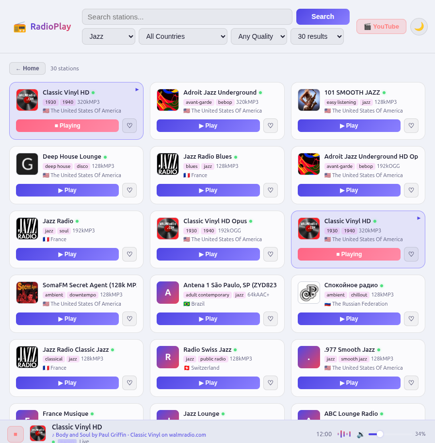
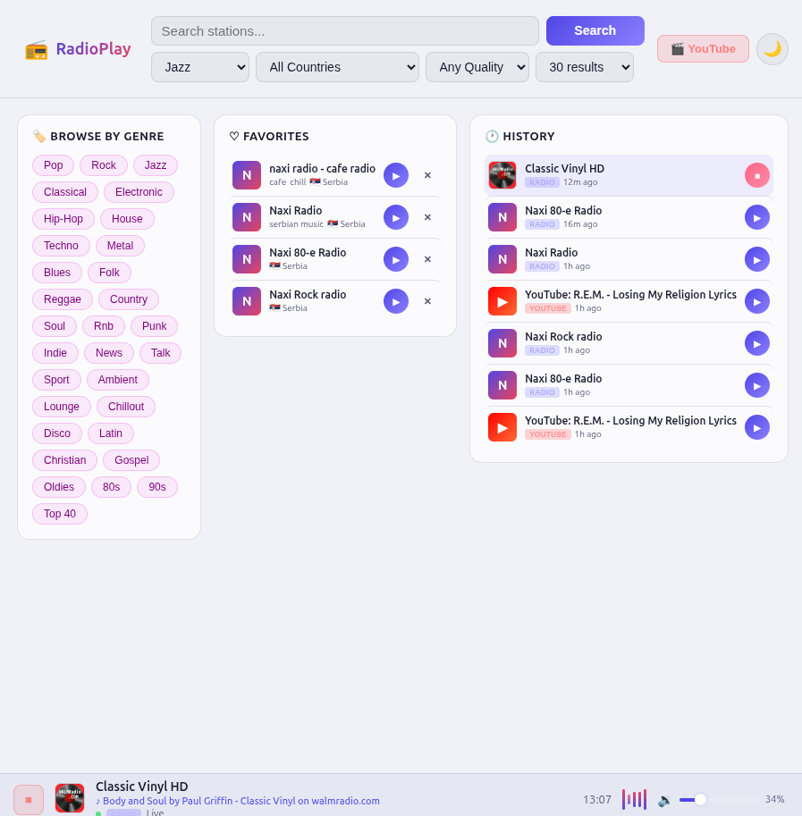

# RadioPlay

A self-hosted web radio & YouTube audio player. Searches 30 000+ stations via the [Radio Browser API](https://www.radio-browser.info/), plays them through VLC on the server, and displays live ICY stream metadata (now-playing song titles).

Supports YouTube URLs via yt-dlp → VLC. Runs entirely on a headless Linux server with PipeWire audio.

> Inspired by [RompR](https://fatg3erman.github.io/RompR/) — a great self-hosted music player for MPD/Mopidy.

## Screenshots

**Search results** — dark mode, station grid with bitrate, genre tags, country flags and live status indicators:



**Home screen** — Browse by Genre, Favorites, and History panels. Player bar shows live ICY metadata (now-playing song title from the stream):



## Features

- Search radio stations by name, genre, country, bitrate
- One-click server-side playback via VLC (no browser audio tab required)
- Live ICY metadata — song/artist titles from the stream
- YouTube audio playback via yt-dlp
- Volume control from the browser (via WirePlumber/wpctl)
- Playback history (SQLite)
- Favorites and history (browser localStorage — no database needed)
- Dark / light theme
- Responsive mobile-friendly grid

## Requirements

| Dependency | Notes |
|---|---|
| PHP 8.1+ | With `posix` extension |
| Apache / nginx | With PHP-FPM or mod_php |
| VLC (`cvlc`) | `sudo apt install vlc` |
| PipeWire + WirePlumber | Running as your audio user |
| yt-dlp | For YouTube support |
| SQLite3 | Not required — history and favorites use browser localStorage |

## Installation

### 1. Clone / copy the app

```bash
git clone https://github.com/yourname/radioplay.git /var/www/html/radioplay
# or just copy the folder to your web root
```

### 2. Configure the app

```bash
cp api/config.example.php api/config.php
nano api/config.php
```

Set `RP_MEDIA_USER` to the Linux user that runs your audio session (PipeWire/PulseAudio). All other values can stay at their defaults unless your paths differ.

### 3. Create the wrapper scripts

RadioPlay's PHP backend (running as `www-data`) needs to launch VLC and control volume as your audio user. Two small wrapper scripts handle this.

```bash
# Find your audio user's UID
id youruser   # e.g. uid=1000

# Edit the templates
cp install/radioplay-vlc.sh /tmp/radioplay-vlc
sed -i 's/MEDIA_USER/youruser/g; s/MEDIA_UID/1000/g' /tmp/radioplay-vlc
sudo cp /tmp/radioplay-vlc /usr/local/bin/radioplay-vlc
sudo chmod 755 /usr/local/bin/radioplay-vlc

cp install/radioplay-volume.sh /tmp/radioplay-volume
sed -i 's/MEDIA_UID/1000/g' /tmp/radioplay-volume
sudo cp /tmp/radioplay-volume /usr/local/bin/radioplay-volume
sudo chmod 755 /usr/local/bin/radioplay-volume
```

### 4. Configure sudo

```bash
sudo cp install/sudoers.example /etc/sudoers.d/radioplay
sudo chmod 440 /etc/sudoers.d/radioplay
sudo sed -i 's/MEDIA_USER/youruser/g' /etc/sudoers.d/radioplay
# Verify syntax
sudo visudo -c
```

This allows `www-data` to run the two wrappers and `pkill` as your audio user, without a password.

### 5. Install yt-dlp (optional, for YouTube)

```bash
# Latest version from the project's GitHub releases:
sudo curl -L https://github.com/yt-dlp/yt-dlp/releases/latest/download/yt-dlp \
     -o /usr/local/bin/yt-dlp
sudo chmod 755 /usr/local/bin/yt-dlp

# Or via apt (may be older):
sudo apt install yt-dlp
```

Update `RP_YTDLP_PATH` in `api/config.php` if you install it elsewhere.

### 6. Web server

**Apache** — enable `mod_rewrite` if you want clean URLs (not required). Example vhost:

```apache
<VirtualHost *:80>
    ServerName radio.yourdomain.com
    DocumentRoot /var/www/html/radioplay
    <Directory /var/www/html/radioplay>
        AllowOverride All
        Require all granted
    </Directory>
</VirtualHost>
```

**nginx + PHP-FPM:**

```nginx
server {
    listen 80;
    server_name radio.yourdomain.com;
    root /var/www/html/radioplay;
    index index.html;

    location /api/ {
        try_files $uri $uri/ =404;
        fastcgi_pass unix:/run/php/php8.1-fpm.sock;
        fastcgi_index index.php;
        include fastcgi_params;
        fastcgi_param SCRIPT_FILENAME $document_root$fastcgi_script_name;
    }
}
```

### 8. Verify

```bash
# Check VLC works as your audio user
sudo -u www-data sudo -u youruser /usr/local/bin/radioplay-vlc --version

# Open the app in a browser
http://yourserver/radioplay/
```

Search for a station, hit Play, and verify you hear audio.

## Architecture

```
radioplay/
├── index.html          # Single-page app shell
├── css/style.css       # Dark glassmorphism + light theme
├── js/app.js           # Vanilla JS: search, play, status polling, ICY metadata
├── api/
│   ├── config.php      # ← Your local config (git-ignored)
│   ├── config.example.php
│   ├── search.php      # Proxy to Radio Browser API
│   ├── play.php        # Kill old VLC, start new stream
│   ├── stop.php        # Kill VLC
│   ├── status.php      # Is VLC alive? What's playing?
│   ├── metadata.php    # Fetch ICY StreamTitle from stream
│   ├── volume.php      # wpctl volume control
│   ├── youtube.php     # yt-dlp → VLC
│   └── _kill_vlc.php   # Process kill helpers (internal)
├── install/
│   ├── radioplay-vlc.sh      # VLC wrapper template
│   ├── radioplay-volume.sh   # Volume wrapper template
│   └── sudoers.example       # sudo rules template
└── .gitignore
```

## How it works

1. **Search** — PHP proxies queries to the public Radio Browser API and returns station metadata (name, URL, bitrate, country, tags, favicon).

2. **Play** — PHP kills any existing VLC process, writes `/tmp/vlcnow.json`, then runs `sudo -u MEDIA_USER radioplay-vlc --no-video --quiet <url>` in the background. The PID is saved to `/tmp/vlcplay.pid`.

3. **Status** — Polling checks that the PID is still alive via `posix_kill($pid, 0)`.

4. **ICY Metadata** — `metadata.php` opens a raw TCP/SSL socket to the stream, sends `Icy-MetaData: 1`, reads the `icy-metaint` header, skips the audio bytes, and parses `StreamTitle` from the metadata block. Polled every 25 seconds.

5. **Volume** — `wpctl set-volume` targets the VLC node by PID in the PipeWire graph.

6. **YouTube** — `yt-dlp -g` extracts the direct audio URL, which is then played via VLC exactly like a radio stream.

## Troubleshooting

**No audio after clicking Play**
- Check PipeWire is running: `systemctl --user status pipewire` (as your audio user)
- Check VLC is launching: `cat /tmp/vlcplay.log`
- Verify sudo works: `sudo -u www-data sudo -u youruser /usr/local/bin/radioplay-vlc --version`

**YouTube error "Failed to extract stream URL"**
- Update yt-dlp: `sudo yt-dlp -U` or re-download the binary
- Test manually: `yt-dlp -g --format 'bestaudio/best' 'https://youtube.com/watch?v=...'`

**stop.php returns 500**
- PHP needs the `posix` extension: `php -m | grep posix`
- Install if missing: `sudo apt install php-common` (usually included)

**ICY metadata not showing**
- Many AAC/HLS streams don't support ICY metadata — this is expected
- Icecast and classic Shoutcast streams (MP3) support it

## License

MIT
